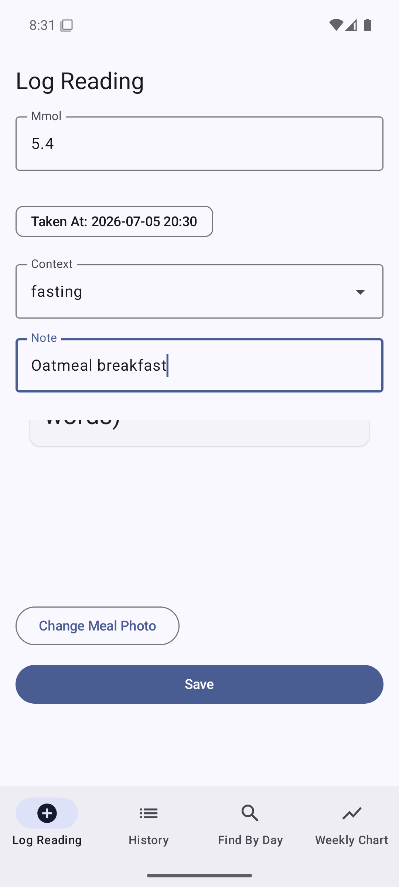
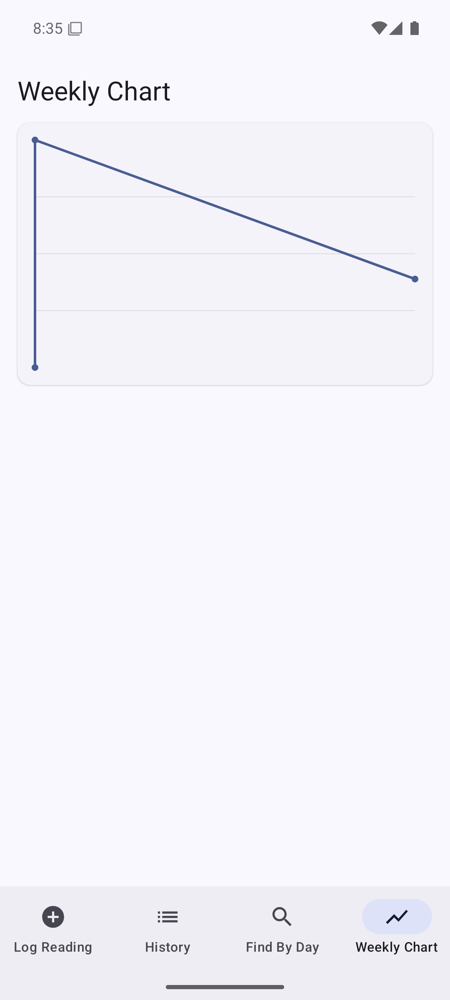
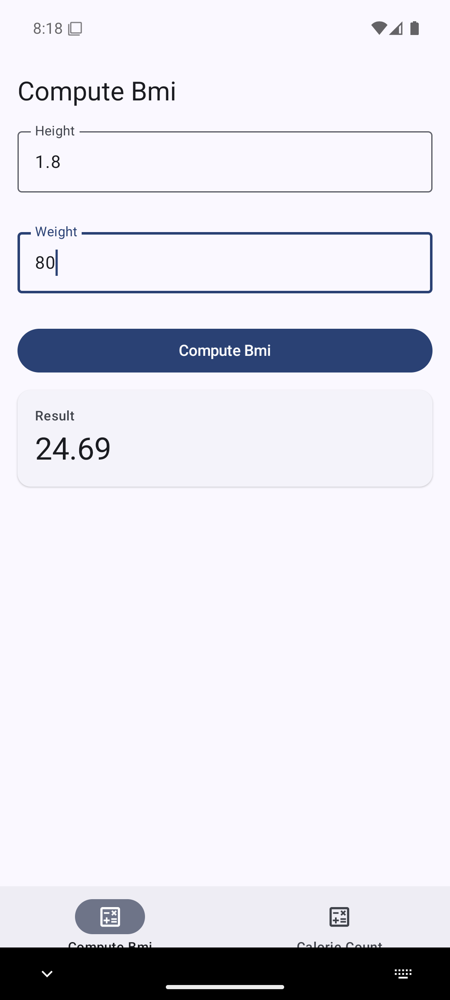

# AppCraft

[](https://github.com/terminalis/appcraft/actions/workflows/ci.yml) [](https://sonarcloud.io/summary/new_code?id=terminalis_appcraft) [](https://sonarcloud.io/summary/new_code?id=terminalis_appcraft) [](https://sonarcloud.io/summary/new_code?id=terminalis_appcraft)

**The deterministic app compiler for the AI era.** Describe an app; an AI agent writes a small, human-readable model; the AppCraft compiler turns that model into a complete, production-grade native app you fully own.

> **Diff, not drift.** With AI app builders, the source of truth is a chat transcript and the artifact is 20,000 lines of code that degrades with every prompt. With AppCraft, the source of truth is a ~200-line model. A feature request is a 5-line reviewable diff. The compiler regenerates the app — deterministically, with guarantees — every time.

## The thesis

Two approaches to building apps are each broken alone:

- **AI code generation** (Bolt, Lovable, Rork, a0.dev) is fast to demo, but the output is probabilistic raw code: it drifts, duplicates, and can't be regenerated without a rewrite. No guarantees, no durable spec.
- **Model-driven development** generates guaranteed-clean native code deterministically — but historically nobody would learn a DSL, so it stayed academic.

AppCraft fuses them: **the LLM is the front-end, the compiler is the back-end.** Agents write and edit the model — never the code. The hallucination surface collapses to a small, schema-validated document; the deterministic compiler guarantees everything below it.

This isn't speculative. The compilation half is peer-reviewed: [*AppCraft: Model-Driven Development Framework for Mobile Applications*](https://doi.org/10.1109/ACCESS.2025.3536321) (IEEE Access, 2025) demonstrated 100% generation of native Android + iOS apps from a small model — including custom logic and on-device ML — with **zero static-analysis bugs and vulnerabilities** (SonarCloud, as classified in 2025) across eight generated apps and **>900% spec-to-code amplification**. The paper's stated future work was a generative front-end that turns natural language into the model. That front-end now exists; it's called an LLM. AppCraft is that fusion, productized.

## How it works

```
"Build a diabetes companion app: log glucose readings
 with meal photos, chart the week, store on-device."
        │
        ▼  (any AI agent, via the AppCraft MCP server)
app.acm.yaml          ← the model: small, diffable, versioned, yours
        │
        ▼  npx appcraft generate   (deterministic — no LLM in the compile path)
Complete native Android project
  Jetpack Compose · Material 3 · Room · Clean Architecture
        │
        ▼  gradle assembleDebug
APK on your emulator
```

Then: *"add a fasting flag to readings and sort history oldest-first"* → a 2-line model diff → recompile → zero drift.

One artifact, three doors:

1. **MCP server** — `get_schema`, `create_app`, `edit_model`, `validate`, `compile`, `preview`. Any agent (Claude Code, Cursor, ChatGPT) builds native apps through three reliable tool calls with machine-checkable errors.
2. **CLI** — `appcraft validate | generate | build` for developers and CI.
3. **Web front-end** — later; the demo surface, not the product core.

## Why a compiler beats codegen (the three properties)

However good frontier models get at writing Kotlin, probabilistic generation structurally cannot match a deterministic compiler on:

1. **Guarantees** — the compiler *proves* properties of its output: architecture invariants, correct permission manifests, no-network on-device ML paths, lint-clean templates. An LLM can only *probably* do these.
2. **Auditability** — a model diff is reviewable by a non-engineer, an auditor, or an agent verifying its own work. A codebase diff is not.
3. **Re-targetability** — the same model recompiles to next year's toolchain, OS version, or a new platform. No vibe-coded app migrates itself.

## What AppCraft is for (and not for)

AppCraft compiles **data + flows + on-device-ML companion apps**: trackers, clinical companions, field-data tools, internal tools. If AppCraft compiles it, it's guaranteed. It is deliberately not for games, social feeds, or video editors — honesty about the ceiling is a feature, and `custom:` escape-hatch blocks (typed Kotlin preserved verbatim across regeneration) cover the last mile.

## Quickstart

```bash
# From the published package:
npx appcraft validate examples/diabetes-tracker/app.acm.yaml
npx appcraft generate examples/diabetes-tracker/app.acm.yaml -o glucolog-android
npx appcraft preview examples/diabetes-tracker/app.acm.yaml -o preview.html
npx appcraft schema --card

# From a source checkout:
npm install && npm run build && npm test
node packages/cli/dist/main.js validate examples/diabetes-tracker/app.acm.yaml
```

**For AI agents (the primary door)** — one command:

```bash
claude mcp add appcraft -- npx -y @appcraft-io/mcp-server
```

Or for any other MCP client:

```jsonc
{
  "mcpServers": {
    "appcraft": { "command": "npx", "args": ["-y", "@appcraft-io/mcp-server"] }
  }
}
```

Agents then build native apps through `get_schema → create_app → edit_model → validate → compile`.

See [docs/AGENTS.md](docs/AGENTS.md) for the agent playbook.

## Verified on device

Every example in [examples/](examples/) compiles with the real Android toolchain (AGP 8.7.3 /
Kotlin 2.0.21 / Compose BOM 2024.10.00) and passes its golden path on an emulator — photo
capture, Room persistence across process death, charts, invariants, and verbatim `custom:`
Kotlin blocks included. Full toolchain record: [KNOWN_GOOD.md](KNOWN_GOOD.md).

Every generated project is also scanned by SonarQube Cloud in CI behind a zero-open-issues
gate: **zero Reliability issues out of the box**, security defaults stricter than Android
Studio's own new-project template (backups and device-to-device transfer disabled,
cleartext traffic refused), and the two remaining findings tracked openly with rationale
(dependency lockfiles and R8 minification — see [ROADMAP.md](ROADMAP.md)). The badges at
the top are live.

| GlucoLog — log with photo | GlucoLog — weekly chart | HealthCalc — BMI |
|---|---|---|
|  |  |  |

## Status

Pre-alpha, phase 1 complete; phase 1.5 (prove & launch) in progress. Current state:

- [x] Model format draft v0 — [docs/MODEL_SPEC.md](docs/MODEL_SPEC.md)
- [x] Three example models — [examples/](examples/)
- [x] JSON Schema + validator with machine-precise errors — [schema/appcraft.schema.json](schema/appcraft.schema.json)
- [x] Expression mini-language (whitelisted identifiers; the injection guard)
- [x] Compiler (TypeScript) → complete Jetpack Compose / Material 3 / Room Gradle project, corrected MVC/VIPER clean architecture, golden + determinism + hygiene test gates
- [x] CLI: `validate | generate | preview | schema`
- [x] MCP server: `get_schema, list_examples, create_app, edit_model, validate, compile, preview`
- [x] Instant HTML preview renderer (deterministic, self-contained)
- [x] **First real builds: all three examples compile with zero template fixes and pass their golden paths on an emulator** — [KNOWN_GOOD.md](KNOWN_GOOD.md)
- [ ] `crud` flow kind, `cloud` storage (0.2)
- [ ] On-device ML blocks: TFLite numData/image (phase 2)
- [ ] iOS / SwiftUI target (phase 2)
- [ ] Hosted build/preview + mHealth compliance pack (phase 3)

Feature roadmap: **[ROADMAP.md](ROADMAP.md)** · Versioning policy: **[docs/VERSIONING.md](docs/VERSIONING.md)**

## Repository layout

```
docs/       model spec, agent playbook, versioning policy, device screenshots
examples/   example app models (.acm.yaml) — all compile clean in CI
packages/   core (schema/validator/expressions) · compiler · preview · cli · mcp-server
schema/     the canonical JSON Schema for app.acm.yaml
```

## Research foundation

Alwakeel, L., Lano, K., & Alfraihi, H. (2025). *AppCraft: Model-Driven Development Framework for Mobile Applications.* IEEE Access, 13, 23658–23699. [DOI: 10.1109/ACCESS.2025.3536321](https://doi.org/10.1109/ACCESS.2025.3536321)

## License

Apache-2.0 — see [LICENSE](LICENSE). The research paper is CC BY 4.0 by its authors;
AppCraft is an independent clean-room implementation and does not imply the authors'
endorsement.
